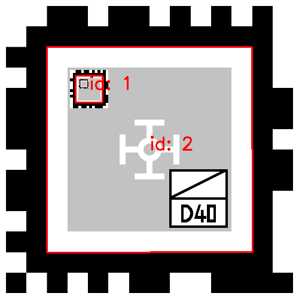
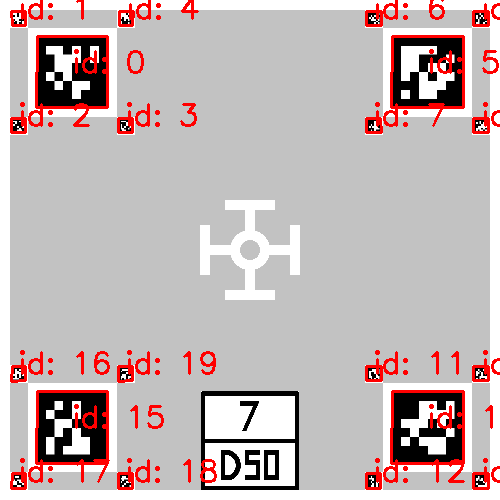
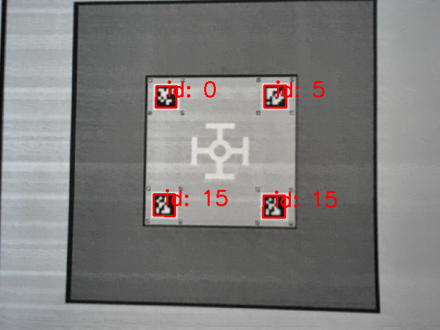
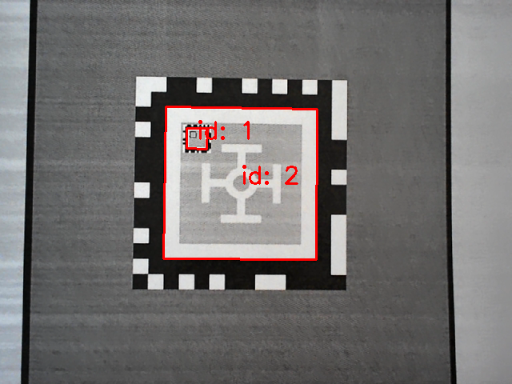

## 0. Preface
This repository provides instructions for detecting multiscale fiducial marker layouts, including non-nested and nested layouts, designed for precise takeoff and landing of flying vehicles integrated into vertiports.

## 1. Installation
Clone this git repository
```
$ git clone https://github.com/tag-nav/multiscale-marker-detection.git
```

To install the library, run the following commands in your terminal:
```
$ cmake -B build -DCMAKE_BUILD_TYPE=Release
$ cmake --build build --target install
```

Note: Make sure that the Python wrapper is successfully installed only when an environment [Conda](https://docs.conda.io/projects/conda/en/latest/index.html) is deactivated. 

## 2. Run demos with Python wrapper
The original implementation for detecting Apriltags in multiscale layouts is in C, and it includes a Python-wrapped library to make development more accessible. This section shows how to use this to demo marker detection on both image and video.

### 2-1. Run demo with image

Please refer to [example/image_demo.ipynb](example/image_demo.ipynb) and [example/image_demo.py](example/image_demo.py) for details.

To run non-nested marker layout detection (with the Tag36h11 family) on [img/non_nested_TLOF.png](img/non_nested_TLOF.png), run the following command:
```
$ python example/image_demo.py --img img/non_nested_TLOF.png --tagtype tag36h11
```


To run nested marker layout detection (with the tagCustom52h12 family) on [img/nested_TLOF.png](img/nested_TLOF.png), run the following command:
```
$ python example/image_demo.py --img img/nested_TLOF.png --tagtype tagCustom52h12
```


### 2-2. Run demo with video

Please refer to [example/video_demo.py](example/video_demo.py) for details. 

To run non-nested marker layout detection (with the Tag36h11 family), run the following command:
```
$ python example/video_demo.py --video 0 --tagtype tag36h11
```


To run nested marker layout detection (with the tagCustom52h12 family), run the following command:
```
$ python example/video_demo.py --video 0 --tagtype tagCustom52h12
```


Note: If the installed Python library is not loaded, follow the commands below [[reference](https://github.com/AprilRobotics/apriltag/issues/46#issuecomment-556875247)] and try again:
```
$ echo 'export LD_LIBRARY_PATH=/usr/local/lib:$LD_LIBRARY_PATH' >> ~/.bashrc
$ source ~/.bashrc
$ sudo ldconfig
```

<!-- 
## What's added
1. `tagCustom52h12` codes:
   - [tagCustom52h12.c](tagCustom52h12.c)
   - [tagCustom52h12.h](tagCustom52h12.h)
2. `tagCustom52h12`-relevant things are appended to the hard-coded list of Apriltag families to be built for detection mode, especially the following files:
   - [apriltag_pywrap.c](apriltag_pywrap.c)
   - [example/apriltag_demo.c](example/apriltag_demo.c)
   - [example/opencv_demo.c](example/opencv_demo.c)

## Run C demo
To run tag36h11 (the tag family for non-nested layout) detection, run
```
./build/apriltag_demo -f tag36h11 ./example/non_nested_000_resized.jpg
```

To run tag52h12 (the tag family for nested layout) detection, run
```
./build/apriltag_demo -f tagCustom52h12 ./example/nested_000_resized.jpg
```

## Run OpenCV demo
Prerequisite: 
- [OpenCV](https://opencv.org/) (Version 4.x preferred)
- Camera connected to the computer

To run tag36h11 (the tag family for non-nested layout) detection, run
```
./build/opencv_demo -f tag36h11
```

To run tag52h12 (the tag family for nested layout) detection, run
```
./build/opencv_demo -f tag52h12
```

Please refer to [example/opencv_demo.cc](example/opencv_demo.cc) and the [user guide](https://github.com/AprilRobotics/apriltag/wiki/AprilTag-User-Guide) to explore more features.
-->
